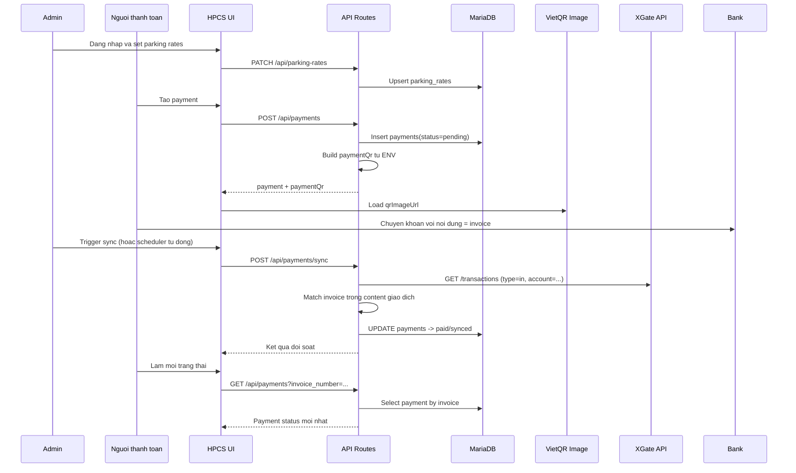

# HPCS Payment Flow

Tài liệu này mô tả end-to-end luồng thanh toán trong hệ thống HPCS: từ phía admin, người thanh toán, đến cơ chế đối soát với XGate.

## 1) Muc tieu va pham vi

- Tao payment pending va sinh QR thanh toan that (VietQR).
- Doi soat giao dich chuyen khoan vao qua XGate de cap nhat trang thai payment.
- Theo doi KPI/doanh thu tren dashboard va trang bao cao.

## 2) Thanh phan tham gia

- Admin:
  - Dieu chinh bang gia parking rates.
  - Trigger doi soat thu cong.
  - Theo doi dashboard, bao cao doanh thu.
- Nguoi thanh toan (nguoi dung da dang nhap):
  - Tao payment pending.
  - Quet QR de chuyen khoan.
  - Refresh trang thai payment.
- He thong scheduler:
  - Tu dong doi soat payment theo chu ky.
- Dich vu ngoai:
  - VietQR (render QR image tu thong tin ngan hang + amount + transfer content).
  - XGate (tra ve giao dich vao de doi soat).

## 3) Cau hinh ENV lien quan

Duoc doc tai runtime tu env, khong hardcode trong code:

- `PAYMENT_QR_BANK_CODE`: ma ngan hang VietQR (hien tai `mb`).
- `PAYMENT_QR_ACCOUNT_NUMBER`: so tai khoan nhan tien (hien tai `9394441571`).
- `PAYMENT_QR_ACCOUNT_NAME`: ten chu tai khoan (hien tai `LE VAN NHAT`).
- `PAYMENT_QR_TEMPLATE`: template QR (`compact2`).
- `XGATE_API_URL`: endpoint XGate transactions.
- `XGATE_API_KEY`: API key XGate.
- `XGATE_ACCOUNT`: loc giao dich vao theo tai khoan nhan.
- `XGATE_TYPE`: loai giao dich (`in`/`out`, luong thanh toan dung `in`).
- `XGATE_PAGE_LIMIT`, `XGATE_MAX_REQUESTS_PER_RUN`: gioi han lay du lieu moi lan doi soat.
- `XGATE_SYNC_ENABLED`, `XGATE_SYNC_INTERVAL_MS`: bat/tat va chu ky scheduler.

File tham chieu:

- `.env.local`
- `DOCS.md`

## 4) So do luong tong quat

## 5) Luong chi tiet theo vai tro

### 5.1 Admin: cau hinh gia va van hanh

1. Admin dang nhap qua trang login.
2. Admin vao trang doanh thu de cap nhat gia theo loai xe.
3. Admin co the trigger doi soat thu cong tren dashboard.
4. Admin theo doi KPI `pendingPayments`, `todayRevenue`, `lastSyncedAt`.

Code lien quan:

- Login UI: `src/app/(auth)/login/page.tsx`
- Auth backend: `src/auth.ts`
- Dashboard UI: `src/app/page.tsx`
- Revenue UI: `src/app/(main)/transactions/page.tsx`
- API set gia: `src/app/api/parking-rates/route.ts`
- API sync thu cong: `src/app/api/payments/sync/route.ts`
- API dashboard: `src/app/api/dashboard/overview/route.ts`
- API revenue: `src/app/api/reports/revenue/route.ts`

### 5.2 Nguoi thanh toan: tao payment va quet QR

1. Nguoi dung vao trang `/payment`.
2. Chon loai xe, phuong thuc, bien so (tuy chon), bam Tao payment.
3. Frontend goi `POST /api/payments`.
4. Backend:
   - Neu thieu amount: lay don gia active tu `parking_rates` theo `vehicleType`.
   - Tao invoice (`HPCS-YYYYMMDD-HHMMSS-rand`) va insert payment `pending`.
   - Build QR tu ENV (bank/account/name/template) + `addInfo=invoice` + `amount`.
5. UI hien QR image that tu `paymentQr.qrImageUrl` de app bank quet chuyen khoan.
6. Sau khi chuyen khoan, nguoi dung bam Lam moi trang thai (`GET /api/payments?invoice_number=...`).

Code lien quan:

- Payment UI: `src/app/(pay)/payment/page.tsx`
- API payments: `src/app/api/payments/route.ts`
- Service payment DB: `src/lib/payments.ts`
- Service build QR: `src/lib/payment-qr.ts`
- Next image allowlist (img.vietqr.io): `next.config.ts`

### 5.3 He thong doi soat XGate

Doi soat co 2 cach:

- Thu cong: goi `POST /api/payments/sync`.
- Tu dong: scheduler bootstrap trong root layout neu `XGATE_SYNC_ENABLED=true`.

Cach hoat dong:

1. Lay danh sach payment `pending`.
2. Goi XGate transactions theo trang, co gioi han request/phut.
3. Ap filter account (`XGATE_ACCOUNT`) va type (`XGATE_TYPE`).
4. Chuan hoa invoice/content (uppercase, bo ky tu dac biet).
5. Neu `content` giao dich co chua `invoice` -> danh dau khop.
6. Update payment: `status=paid`, set `xgate_reference`, `matched_content`, `paid_at`, `synced_at`.

Code lien quan:

- Trigger API: `src/app/api/payments/sync/route.ts`
- Sync service: `src/lib/payment-sync.ts`
- XGate client: `src/lib/xgate.ts`
- Scheduler: `src/lib/payment-sync-scheduler.ts`
- Bootstrap scheduler: `src/app/layout.tsx`

## 6) API map: trang nao goi API nao

| Nguon goi | API | Muc dich | Quyen |
|---|---|---|---|
| `src/app/(auth)/login/page.tsx` | `POST /api/auth/callback/credentials` (NextAuth internal) | Dang nhap | Public (login route) |
| `src/app/(pay)/payment/page.tsx` | `POST /api/payments` | Tao payment pending + tra QR data | Authenticated |
| `src/app/(pay)/payment/page.tsx` | `GET /api/payments?invoice_number=...` | Lay trang thai payment theo invoice | Authenticated |
| `src/app/page.tsx` | `GET /api/dashboard/overview` | KPI dashboard + recent tx + system status | Authenticated |
| `src/app/page.tsx` | `POST /api/payments/sync` | Doi soat thu cong voi XGate | Admin only |
| `src/app/(main)/transactions/page.tsx` | `GET /api/reports/revenue?...` | Bao cao doanh thu/traffic | Authenticated |
| `src/app/(main)/transactions/page.tsx` | `PATCH /api/parking-rates` | Cap nhat bang gia | Admin only |

## 7) RBAC va bao mat

Guard trung tam o `src/proxy.ts`:

- Tat ca API khong dang nhap -> `401 Unauthorized` JSON.
- API admin-only:
  - `POST /api/payments/sync`
  - `PATCH /api/parking-rates`
- Neu khong du role admin -> `403 Forbidden`.

Role duoc dua vao JWT/session trong `src/auth.ts`.

## 8) Model du lieu payment can nam

Bang `payments` (cot quan trong):

- identity: `id`, `invoice_number`
- lien quan thanh toan: `amount`, `currency`, `payment_method`, `status`
- doi soat: `xgate_reference`, `matched_content`, `paid_at`, `synced_at`
- audit: `created_at`, `updated_at`

Trang thai:

- `pending`: vua tao, cho doi soat.
- `paid`: da tim thay giao dich khop invoice.
- `failed`: trang thai loi (neu co logic nghiep vu dat).

## 9) Kich ban van hanh thuc te

### Kich ban A: Thanh toan thanh cong

1. Tao payment tren `/payment`.
2. Quet QR va chuyen khoan dung noi dung invoice.
3. Cho scheduler chay hoac admin bam Sync XGate.
4. Lam moi trang thai payment -> thay `paid`.
5. Dashboard/revenue cap nhat doanh thu.

### Kich ban B: Chua thay giao dich

1. Da tao payment va chuyen khoan, nhung sync tra `matchedInvoices=[]`.
2. Kiem tra:
   - Noi dung chuyen khoan co dung invoice khong.
   - `XGATE_ACCOUNT` co dung tai khoan nhan khong.
   - `XGATE_API_KEY` hop le khong.
   - Giao dich da co tren XGate hay chua (do tre dong bo).

## 10) Trace nhanh theo file

- Payment UI: `src/app/(pay)/payment/page.tsx`
- Payment API: `src/app/api/payments/route.ts`
- Payment DB service: `src/lib/payments.ts`
- QR builder: `src/lib/payment-qr.ts`
- Sync API: `src/app/api/payments/sync/route.ts`
- Sync engine: `src/lib/payment-sync.ts`
- XGate client: `src/lib/xgate.ts`
- Scheduler: `src/lib/payment-sync-scheduler.ts`
- Dashboard UI/API: `src/app/page.tsx`, `src/app/api/dashboard/overview/route.ts`
- Revenue UI/API: `src/app/(main)/transactions/page.tsx`, `src/app/api/reports/revenue/route.ts`
- RBAC: `src/proxy.ts`
- Auth: `src/auth.ts`, `src/app/api/auth/[...nextauth]/route.ts`

---

Neu can, co the mo rong tai lieu voi sequence diagram chi tiet cho tung API (request/response JSON mau) de QA test theo checklist.
